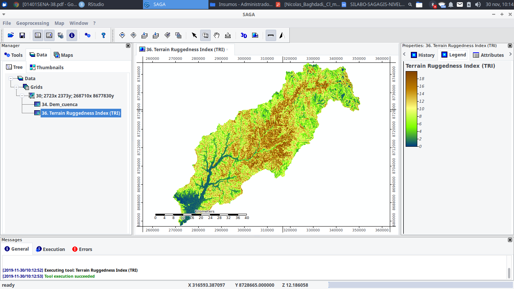
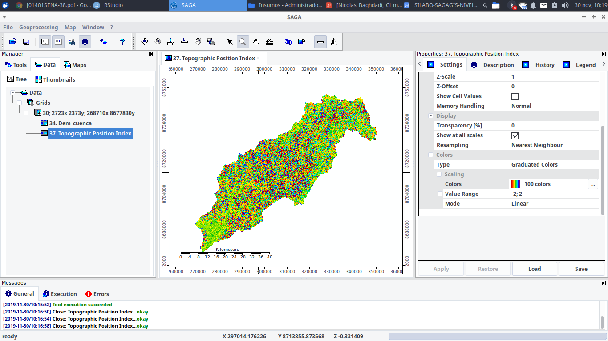
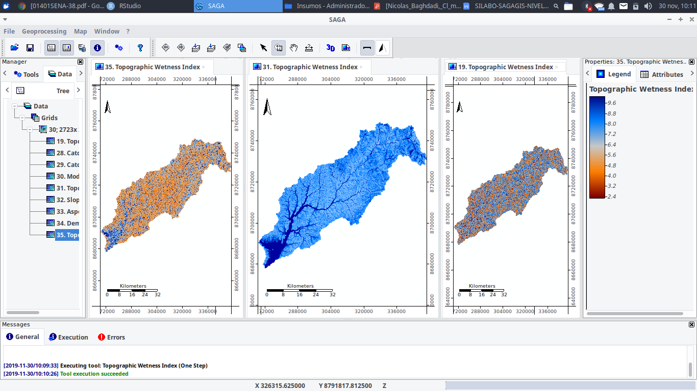
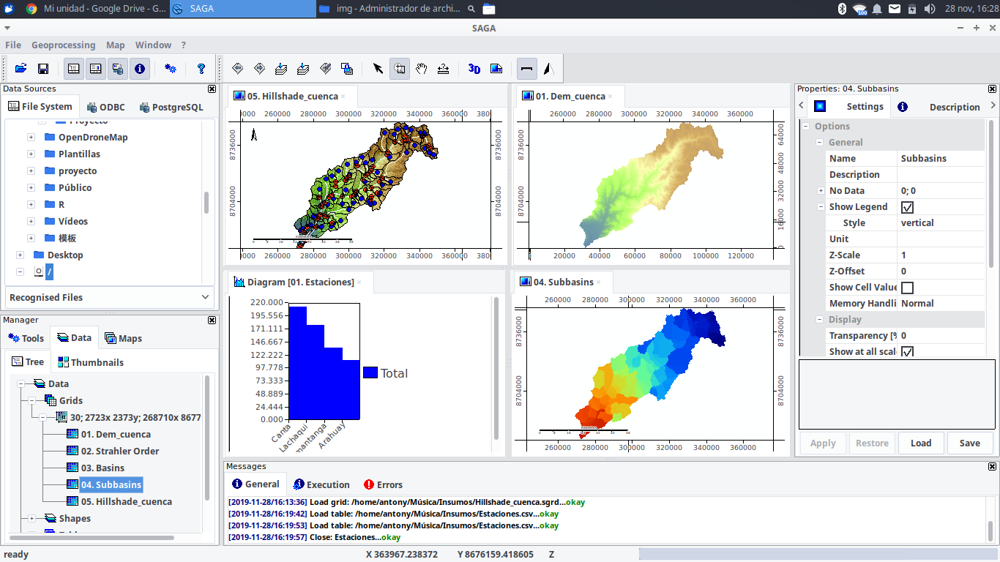

```{r setup, include=FALSE}
options(htmltools.dir.version = FALSE)
```

background-image:url(https://pbs.twimg.com/media/Dd8JsynX4AABaJ0.jpg)
class:Top, inverse
<br>
<br>
<br>
<br> 
# **ALGUNOS ÍNDICES MORFOMÉTRICOS DERIVADOS DE UN DEM**
---
# Índice de rugosidad de terreno
 
```{r,echo=FALSE, out.height=500}

```
---
# Índice posición topográfica
 
```{r,echo=FALSE, out.height=500}

```
---
# Índice de humedad topográfica
 
```{r,echo=FALSE, out.height=400}

```

[**Metodologías**](https://opengeospatialdata.springeropen.com/articles/10.1186/s40965-019-0066-y/figures/4)

---
background-image:url(https://pbs.twimg.com/media/Dd8JsynX4AABaJ0.jpg)
class:Top, inverse
<br>
<br>
<br>
<br> 

# **CARACTERIZACIÓN HIDROGRÁFICA**
---

```{r, echo=FALSE,out.height=550,fig.align='center'}

```
---

background-image:url(https://pbs.twimg.com/media/Dd8JsynX4AABaJ0.jpg)
class:Top, inverse
<br>
<br>
<br>
<br> 
# **TRABAJANDO SAGA + R + QGIS**
---
# Modelo RUSLE
Antecedentes: 
**USLE** 
Ha sido desarrollado para la determinación de la erosión laminar del suelo apartir de una gran cantidad de muestras de datos experimentales(R.Yali,2018).

**RUSLE**
La USDA(Departamento de Agricultura de los Estados Unidos) creo una ecuación universal mejorada del modelo **USLE**.

$$
A = R.K.Ls.C.P
$$
Donde: 
<br>
A: Pérdida de por erosión del suelo en una unidad de área (MJ.mm/Ha.año) 
<br>
K: Factor de erodabilidad del suelo
<br>
Ls: Factor de longitud de pendiente
<br>
C: Cobertura vegetal 
<br>
P: Factor de buenas prácticas de convervación de suelo
---
# Factor R
Expresa la cantida de lluvia necesaria para erosinar el suelo

$$
factorR = 1.735x \textit{10}^{1.5log10( \frac{Pmensual^2}{Ptotal})-0.08188}\
$$

---

---
class:center,inverse
# GRACIAS!
<div>
 
<br/>
<br/>
<div>

<a href="https://github.com/barja8" >barja8.github</a>
 </div>

<div>
 
 <a href=mailto:"antony.barja8@gmail.com">antony.barja8@gmail.com</a>
 </div>

Slides created via the R package [**xaringan**](https://github.com/yihui/xaringan) with [**Kakashi**](https://github.com/malcolmbarrett/kakashi) sytle


