<!-- 14:15 - 15:00 - 45 minute talk  -->
<!-- Aims: show-off the book, provide overview, some useful things in it -->

layout: true
background-image: url(style/img/r_geocomp_background.png)
background-size: cover

---
# Implementación del modelo RUSLE
Antecedentes: 
<br>
**USLE** ha sido desarrollado para determinar la **erosión laminar** del suelo apartir de una gran cantidad de muestras de datos experimentales para una área de hasta de 1 ha [(R.Yali,2018)](http://cybertesis.unmsm.edu.pe/handle/cybertesis/137/browse?type=author&value=Yali+Samaniego%2C+Roy+Marco).

Años posteriores el Departamento de Agricultura de los Estados Unidos (USDA) decide crear una ecuación universal mejorada del modelo a lo que lo llamaron **RUSLE**.

La ecuación de **RUSLE** se expresa de la siguiente manera:

$$
A = R.K.Ls.C.P
$$
Donde: 
<br>
A: Pérdida de suelo promedio por erosión en una unidad de área (MJ.mm/Ha.año) 
<br>
K: Factor de erodabilidad del suelo
<br>
Ls: Factor de longitud de pendiente
<br>
C: Cobertura vegetal 
<br>
P: Factor de buenas prácticas de convervación de suelo
---
# Cálculo de los diferentes parámetros
## Factor Erosividad (R)
Para nuestra aplicación se considero la fórmula desarrollada por (Wischmeier & Smith, 1978)
```{r, echo=FALSE,out.height=360}
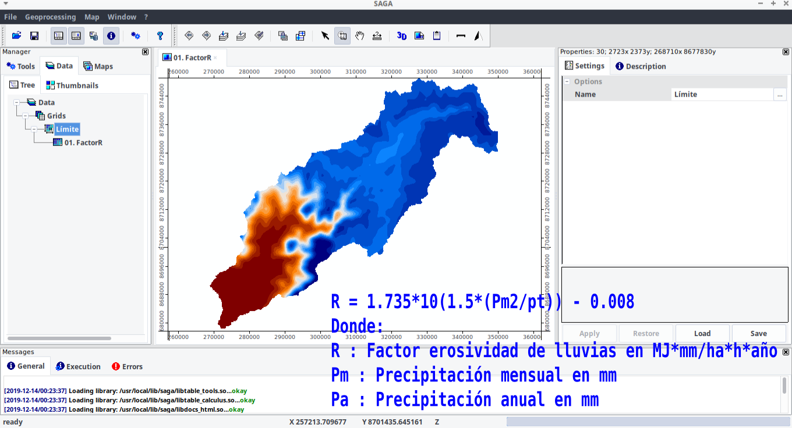
```
---
## Factor de erodabilidad del suelo (K)
Nos ayuda a entender que tan suceptible es el suelo a la erosión hídrica, para nuestra aplicación se considero la ecuación de Zhu et. al. (2014)

```{r, echo=FALSE,out.height=360}
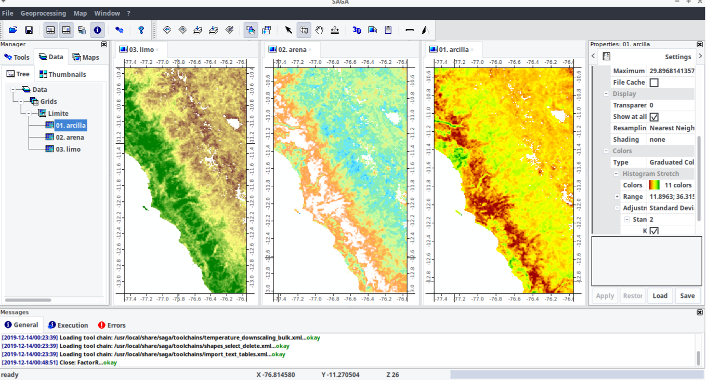
```
---
# Factor relieve (Ls)
Expresa los efectos de la topografía local sobre la tasa de erosión del suelo,combinando los efectos de la longitud de la pendiente (L) y la inclinación de la pendiente (S) [(R.Yali,2018)](http://cybertesis.unmsm.edu.pe/handle/cybertesis/137/browse?type=author&value=Yali+Samaniego%2C+Roy+Marco).

```{r, echo=FALSE,out.height=360}
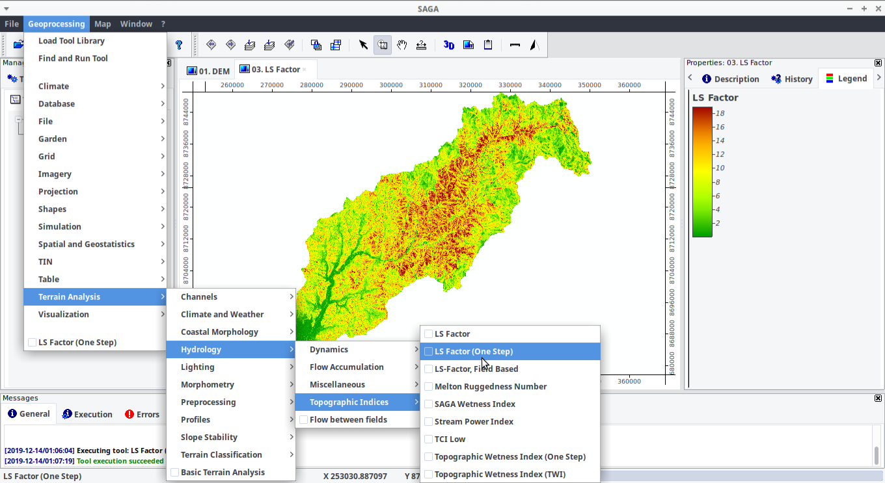
```
---
## Factor de cobertura vegetal (C)
Covertura vegetal, para nuestro caso se obtuvo mendiante una clasificación no supervizada en donde luego se procedio a identificar los cluster para luego darle los valores respectivos según el cuadro de valores mostrado por **Sabino (2016)**.

```{r, echo=FALSE,out.height=360}
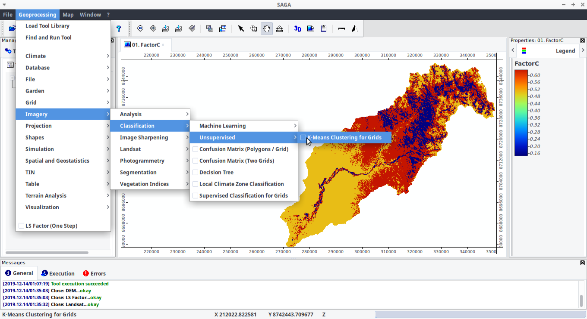
```

---
## RUSLE
La ecuación RUSLE emplea un factor P de 1,cuando se desea reflejando el deseo de predecir la erosión potencial bajo las condiciones actuales de ninguna práctica de conservación de suelos. 

```{r, echo=FALSE,out.height=360}
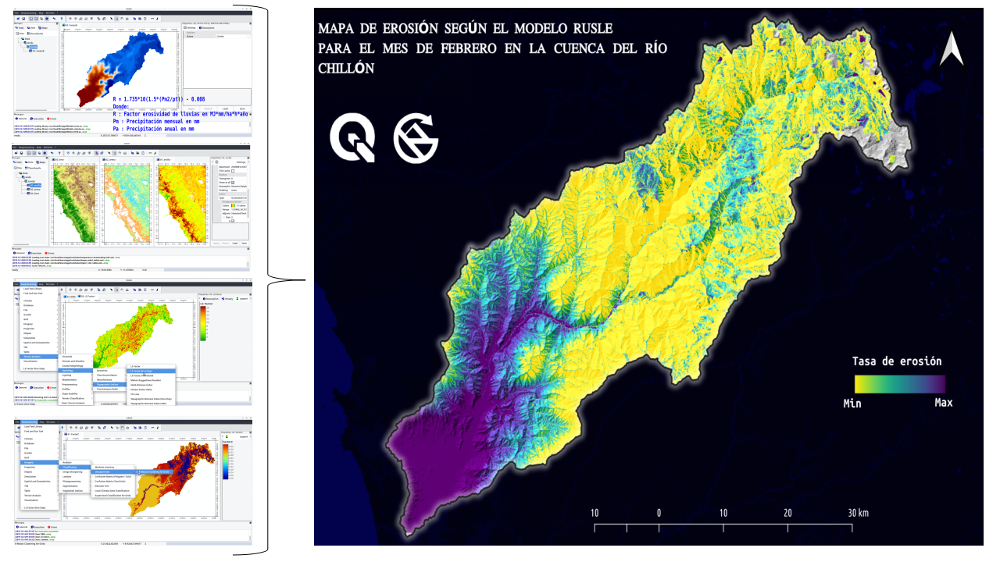
```
---
class:center,inverse,middle
# Aplicaciones de teledetección con SAGAGIS 
---
# Clasificacion no supervizadas y supervizada
SAGA presenta algunos módulos para teledetección; sin embargo estós son muy lìmitados a comparación con otros softwares como **SNAP**, **OTB**, **QGIS**, entre otros.Para la presente sesión vamos a emplear los algoritmos de **K-means** y **SVM**.

```{r, echo=FALSE,out.height=300}
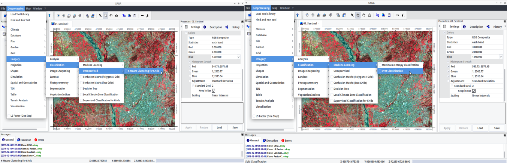
```

---
# Clasificación no supervizada

```{r, echo=FALSE,out.height=400}
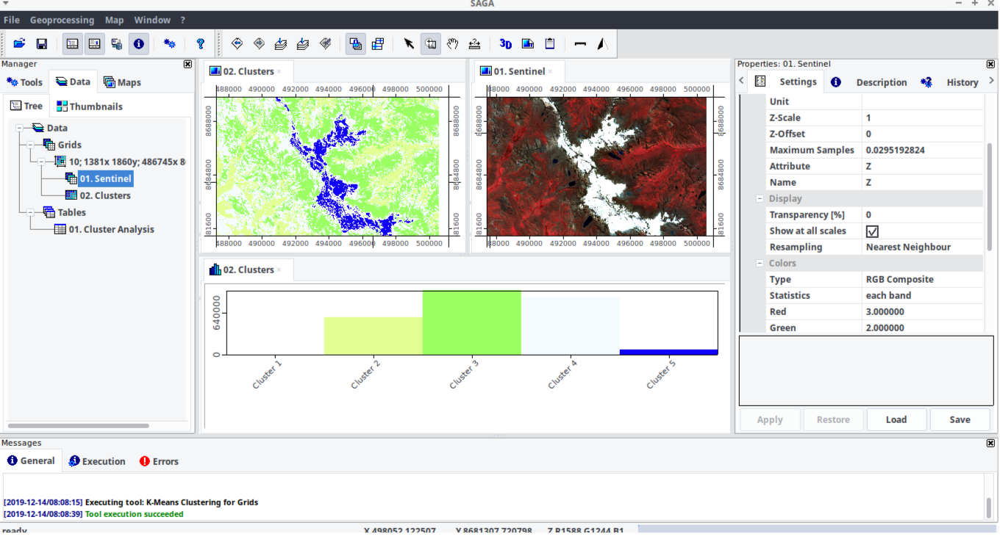
```

---
# Clasificación supervizada

```{r, echo=FALSE,out.height=400}
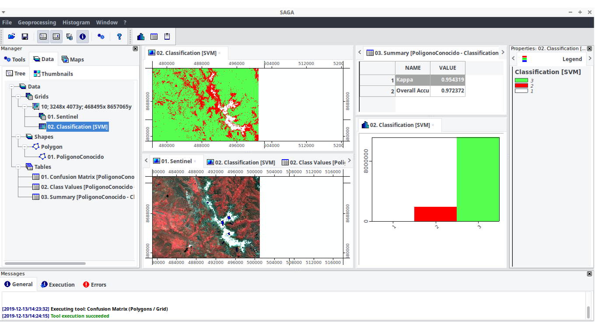
```

---
# OBIA para el mapeo de flujos de dentritos
Object Based Image Analysis (OBIA) es una técnica de clasificación de imágenes basadas en fragmentaciones de regiones espectrales homegeneas.

```{r, echo=FALSE,out.height=340}
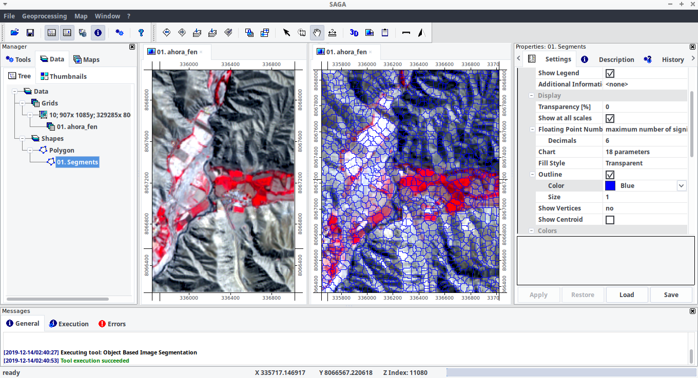
```
---
# Estimación del riesgo por flujo de dentritos integrando SAGA + QGIS 

```{r, echo=FALSE,out.height=350}
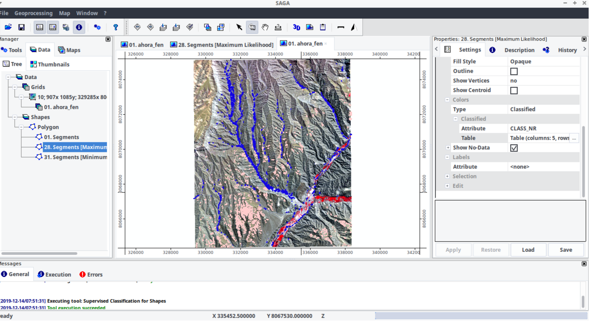
```

---
class:center,inverse,middle
# Integrando R con SAGA 

---
# Procedimientos para la instalación de RSAGA

Primero tener instalado una version más estable de SAGA compatible con R (SAGA LTS 2.3.1)

```{r, eval=FALSE}
# Instalación del paquete RSAGA
# install.packages('RSAGA', dep = TRUE)
library(RSAGA)

# Verificación de la conexión de R con SAGA
env <- rsaga.env()
print(env)

# Paquetes adicionales 
library(raster)    # Para manejar datos raster
library(sf)        # Para manejar datos vectoriales
library(tmap)      # Elaboración de mapas temáticos
library(cptcity)   # Paleta de colores 
library(tidyverse) # Ciencia de datos
```

---
# Elaboración de mapa de susceptibilidad a deslizamientos usando RSAGA

```{r, echo=FALSE,out.height=450}
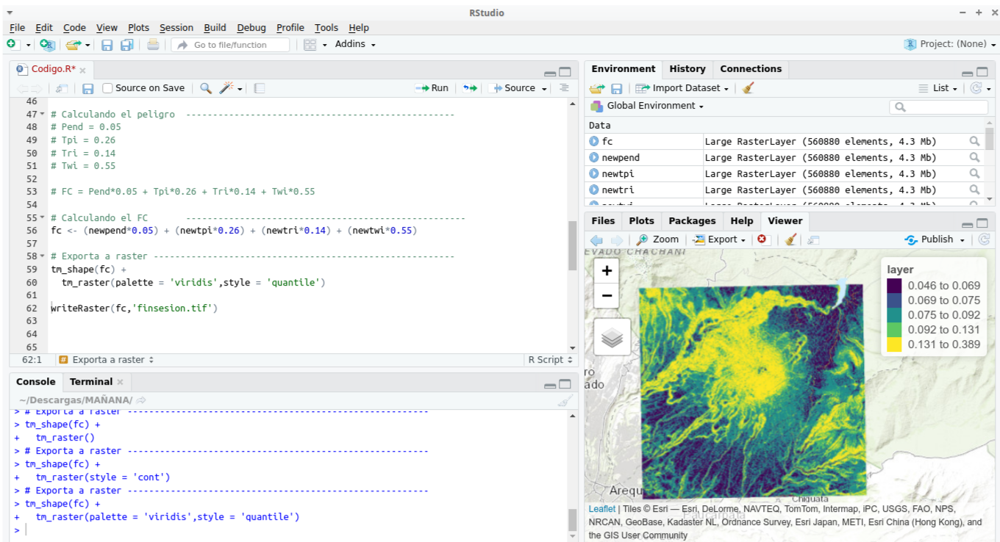
```

---
class:center,inverse
# GRACIAS!
<div>
 
<br/>
<br/>
<div>

<a href="https://github.com/barja8" >barja8.github</a>
 </div>

<div>
 
 <a href=mailto:"antony.barja8@gmail.com">antony.barja8@gmail.com</a>
 </div>

Slides created via the R package [**xaringan**](https://github.com/yihui/xaringan)

